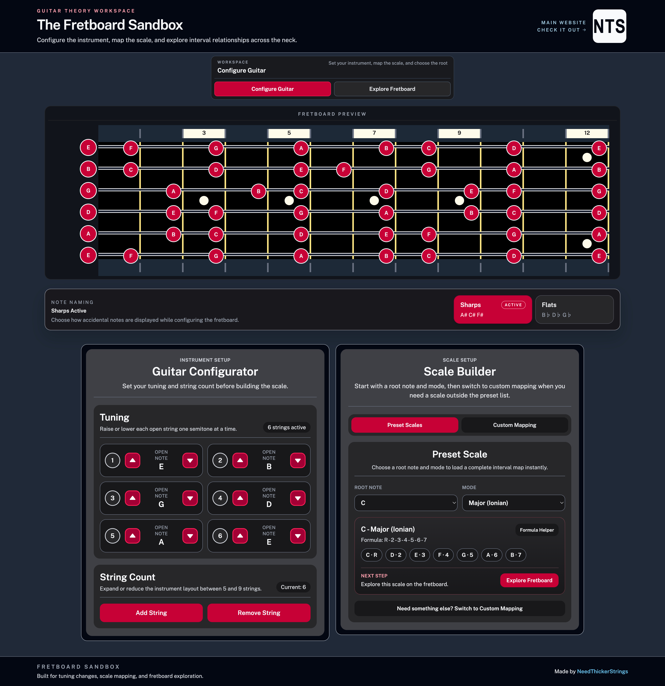

# Guitar Fretboard Generator

> This project is a guitar fretboard sandbox for configuring tunings, building scales, selecting root notes, and exploring interval relationships across the neck. It is built with Vue.js, Pinia, Tailwind CSS, and Vite.

### Guitar Fretboard Generator Screenshot:



# Getting Started

To get a local copy of the repository please run the following commands in your terminal:

```bash
$ cd <folder>
```

```bash
$ git clone git@github.com:jacobrees/Guitar-Fretboard-Generator.git
```

To launch an instance of this app, navigate into the repository you have just cloned and install the project dependencies.

Below shows the following commands you will need to run to achieve this:

```bash
$ cd Guitar-Fretboard-Generator
```

```bash
$ npm install
```

```bash
$ npm run dev
```

# Scripts

Below are a list of scripts you can use with Vite.

Run `npm install` to install all packages associated with the project. You will need to do this before you can run any of the other commands listed below.

```bash
$ npm install
```

Run `npm run dev` to start a development server.

```bash
$ npm run dev
```

Run `npm run build` to bundle all code into the `dist` directory.

```bash
$ npm run build
```

Run `npm run preview` to preview the production build locally.

```bash
$ npm run preview
```

## Built With

- Vue.js
- Pinia
- Tailwind CSS
- Vite

## Authors

👤 **Jacob Rees**

- Github: [@jacobrees](https://github.com/jacobrees)
- Linkedin: [jacob-rees](https://www.linkedin.com/in/jacob-rees/)

## 🤝 Contributing

Contributions, issues and feature requests are welcome!

## Show your support

Give a ⭐️ if you like this project!
